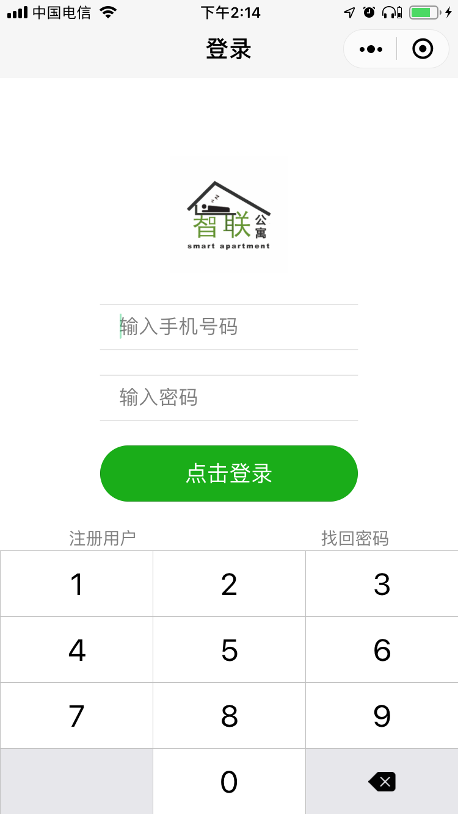

# 智联公寓小程序插件

本插件用于集成智联公寓智能门锁系统主要服务，为客户提供小程序快速接入体验。
***



***

## 一. 插件接口说明
### 1.1 plugin生命周期
plugin的生命周期，与小程序App生命周期同步
  * **onLaunch()**
    > 同App.onLaunch,**必须调用**
  * **onShow()**
    > 同App.onLaunch,**必须调用**
  * **onHide()**
    > 同App.onLaunch,**必须调用**
    
### 1.2 登录注册
  * **setLoginOnLaunchOption(options)**
    > **必须在pages/login/login.js的onLoad方法中调用，并传入options参数**
  * **checkSession()**
    > 用户登录态检测，建议在pages/login/login.js的onShow()方法调用
    > 传入success回调，返回是否登录isLogged状态，以及下一个跳转界面路径pageUrl
  * **login()**
    > 用户登录接口，传入data:{cc:86, phone:"手机号码", password:"密码"}
    > 传入success和fail回调，返回是否登录成功，以及登录成功后下一个跳转界面路径pageUrl，或登录失败信息
  * **sendSmsCode()**
    > 发送短信验证码接口，传入data:{cc:86, phone:"手机号码", password:"密码"}
    > 传入success和fail回调，返回短信验证码校验信息{code:200, data:{exp: 1547792535962, token: "49b714ec1f422d5980b4a96fc80ee80673e60ad2e0684cf30ec3175a735c1138"}}
  * **register()**
    > 用户注册接口，或者用户重置密码，传入data: {cc: 86, phone: "手机号码", password: "密码", 
    smscode: "455933",exp: 1547792535962, token: "49b714ec1f422d5980b4a96fc80ee80673e60ad2e0684cf30ec3175a735c1138",
    nickName: "柳暗花明",gender: 1,avatarUrl: "https://wx.qlogo.cn/mmopen/vi_32132"}
    > 传入success和fail回调，返回是否注册成功！
***
## 二. 小程序配置示例

### 2.1 app.json
请在小程序app.json中，配置插件版本以及引用插件自带的组件。
```
  "plugins": {
    "myPlugin": {
      "version": "lastest-version",
      "provider": "wxa76af7d988db7838"
    }
  },
  "usingComponents": {
    "inputBox": "plugin://myPlugin/inputBox",
    "multiSelector": "plugin://myPlugin/multiSelector"
  }
```
### 2.2 app.js
请在小程序app.js中，调用插件的生命周期函数。
```
var plugin = requirePlugin("myPlugin")
App({
  onLaunch: function () {
    plugin.onLaunch()
  },
  onShow: function(){
    plugin.onShow()
  },
  onHide: function(){
    plugin.onHide()
  }
})
```
### 2.3 实现login Page
请在小程序中，新建页面pages/login/login，完成登陆逻辑。

加载插件
```
var plugin = requirePlugin("myPlugin")
```

调用插件加载参数
```
  onLoad: function(options) {
    var that = this
    console.log('onLoad', options)
    plugin.setLoginOnLaunchOption(options)
  },
```
判断登录状态，避免重复登录
```
  onShow: function() {
    var that = this
    plugin.checkSession({
      success: function(data) {
        if (data.isLogged) {
          wx.redirectTo({
            url: data.pageUrl,
          })
        }
      }
    })
  },
```
登录实现，传入登陆用户手机号和密码，返回登陆状态
```
  // 用户登录示例
  login: function(e) {
    var that = this

    plugin.login({
      data: {
        cc: 86,
        phone: cellphone,
        password: password
      },
      success: function(res) {
        console.log('success', res)
        wx.showToast({
          title: res.msg,
        })
        wx.redirectTo({
          url: res.pageUrl,
        })
      },
      fail: function(e) {
        console.log('fail', e)
        wx.showModal({
          title: '登录失败',
          content: e.message,
          showCancel: false
        })
      }
    })
  }
```
